## R and R-Studio

Up until now, we have been using R in a very simplified manner, directly in this book. For the at home exercises, and later on in the course, we'll use something called R-Studio: an interface designed to make R easier to work with (known as an IDE).

For this course, the data, files, and interface are all already set up for you in a workspace on a service called 'Posit cloud'. Later on, you may want to install R and R-Studio on your local machine. See [here](https://posit.co/download/rstudio-desktop/) for instructions on how to do this. The software is completely free and open-source.

By the end of today, you should understand what an IDE is, know how to set up a notebook, and be able to write and knit a simple R Markdown document.

### Logging into Posit Cloud and opening a notebook.

The first step is to create an account with Posit cloud. This is a service which will allow you to load R remotely, so you can complete this practical sessions for this course (you can also use R and R studio on your local machine if you use it already).

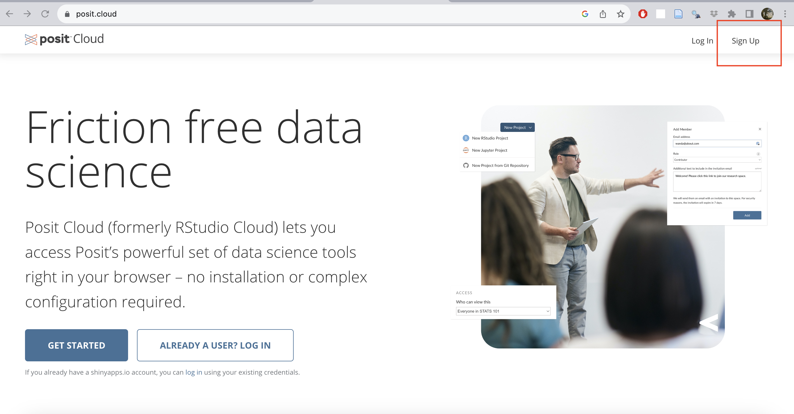

Sign up to Posit cloud with an email address here: <https://posit.cloud/plans>

Click on 'Learn more' under the Free plan, and then 'Sign up'.

Click on the invite link posted on Brightspace. Once you have signed up, click on the 'burger' icon to the left of 'Your Workspace' to open a sidebar, which will allow you to switch to the correct workspace 'Cultural Analytics':

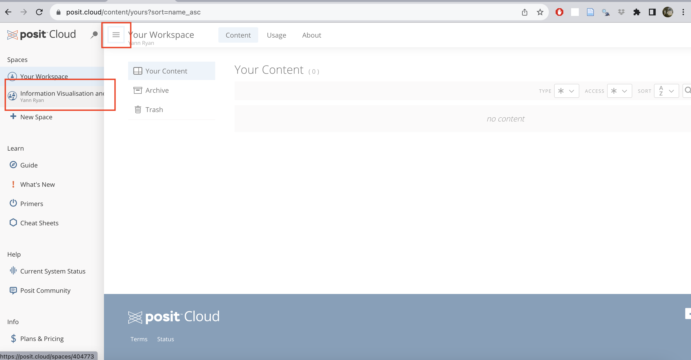

Once you have switched, you'll see a list of assignments and projects. At the moment, there is just one for this week. Click the start button for 'Week 2: Introduction'.

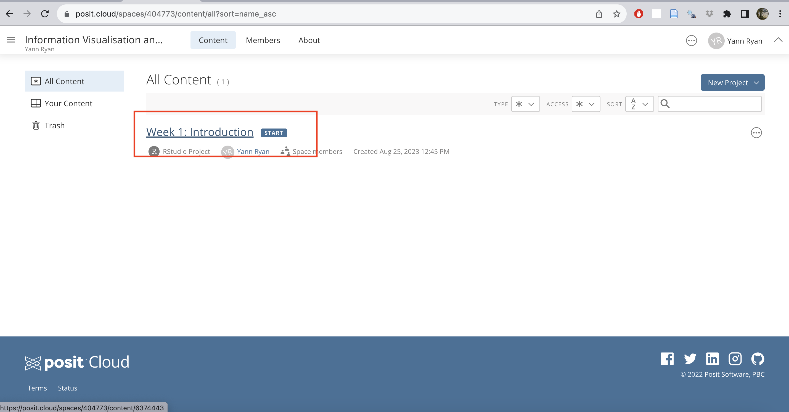

This will load, and you should shortly be greeted with the Rstudio interface -- this is an environment for creating and editing R code.

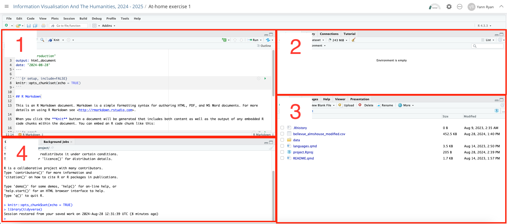

R-Studio is divided into four different sections, or *panes*. Each of these also has multiple tabs. Starting from the top-left (numbered 1):

1.  The source editor. Here is where you can edit R files such as RMarkdown or scripts.

2.  The environment pane will display any objects you create or import here, along with basic information on their type and size.

3.  This pane has a number of tabs. The default is files, which will show all the files in the current folder. You can use this to import or export additional files to R-Studio from your local machine.

4.  The console allows you to type and execute R commands directly: do this by typing here and pressing return.

All four of these panes are important, and it's worth exploring more of the buttons and menu items. Throughout this course, you'll complete exercises by using the source editor to edit notebooks. As you execute code in these notebooks, you'll see objects pop into the environment pane. The console can be useful to test code that you don't want to keep in a document. Lastly, getting to know how to use and navigate the directory structure using the files pane is essential.

You can play around with the R-Studio interface. Don't worry about breaking anything, but you should regularly save your work.

## Your Derived Workspace

You can return to the workspace overview by clicking on the sidebar and on the 'Cultural Analytics\[...\]' menu item again.

If you do this, you'll see that there are now *two* workspace items. This is because when you started the workspace, it created a 'derived' version - meaning it has created a unique copy for you to work with, without changing the original one.

You can delete this version, copy it, or export a copy to your local machine. When you want to resume your work, you should open this copy. **Please note that as the instructor, I can see and edit all the derived workspaces.**

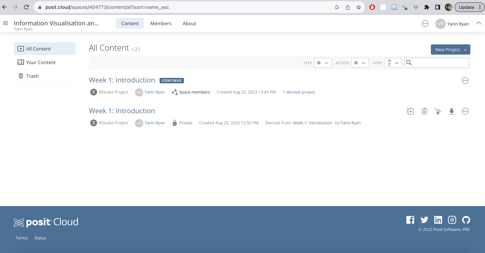

## R Markdown and 'Knitting' a Document

There are several ways to create and execute code within R studio, such as creating scripts or typing into the console (the bottom-left pane).

However, in this course, we'll exclusively use one method: R Markdown notebooks.

These are special documents which can include code and text. Text is written using a simple format called Markdown, and code goes into special 'cells' within the document. Once you're finished, you'll tell R studio to execute all the code in the document and render it as an html file. This process is called 'knitting'.

We'll worry more about code in the next session, but for now, let's just get used to creating R Markdown files, knitting them, and downloading them to your local machine so they can be sent as assignments.

### Create a new markdown file

Click file -\> new file -\> R Markdown

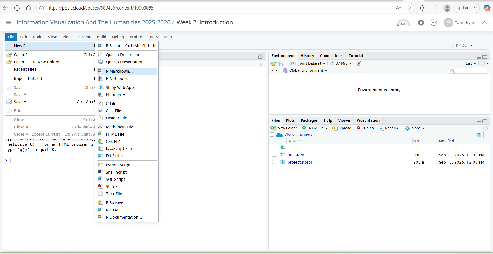

If asked to install packages, just click yes, and wait a little longer.

You'll get a pop-up with some options, as there are several types of markdown documents you can make. The defaults are OK; you don't need to change anything, so just click OK. You can add a title here if you like, but it is easy to do later.

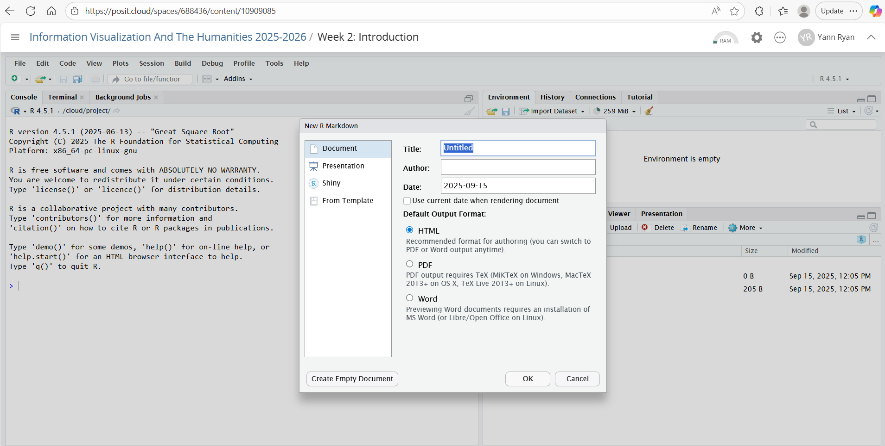

At the moment, there is some sample text and code in the document.

At the top of the document is some formatted text which looks like this:

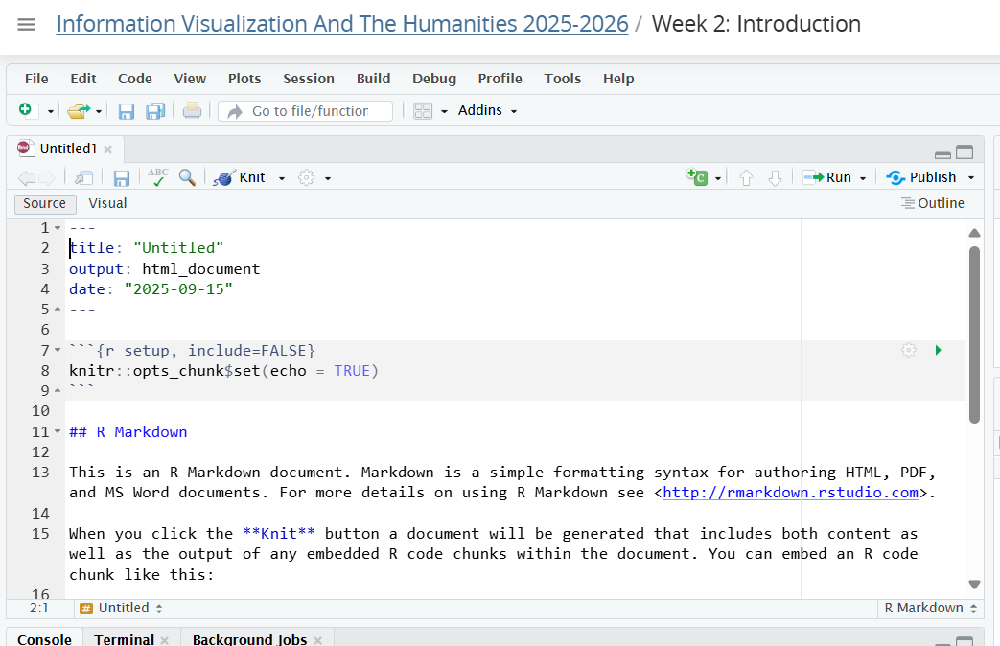

This is called a yaml header. It contains information about your document, and it needs to remain here for the notebook to work. You can use this yaml header to edit the title of your report: just edit the text within the quotation marks which now reads 'R Notebook'.

You should delete the rest of the text in the document: highlight and delete the rest of the contents of the notebook, using delete/backspace.

### Type some text

Type some text. There are two ways of doing this. You can use the source editor, which is the default view. You can switch between Source and Visual using the button above.

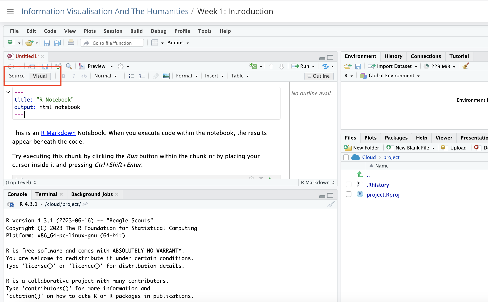

In the source editor, use markdown. This is a very simple coding language used to render text on the internet. There are codes for bold, italics, headings. You can add images etc. You can switch between the two at any time.

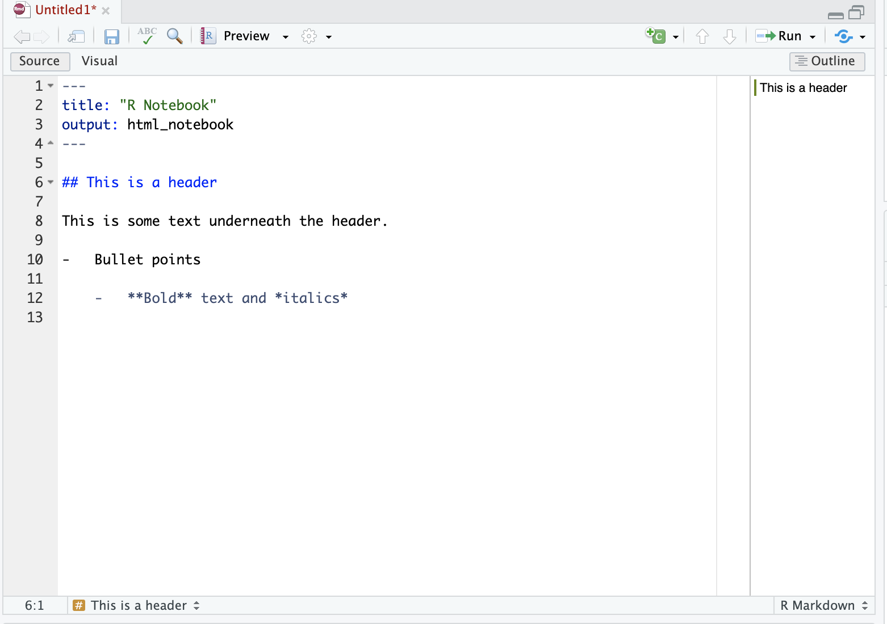

In the visual editor, use the menu items to format your text. For example bold, italics, headings. You can use the drop-down menu to add images, tables, and so forth, as you would with word processor software such as Word or Google docs.

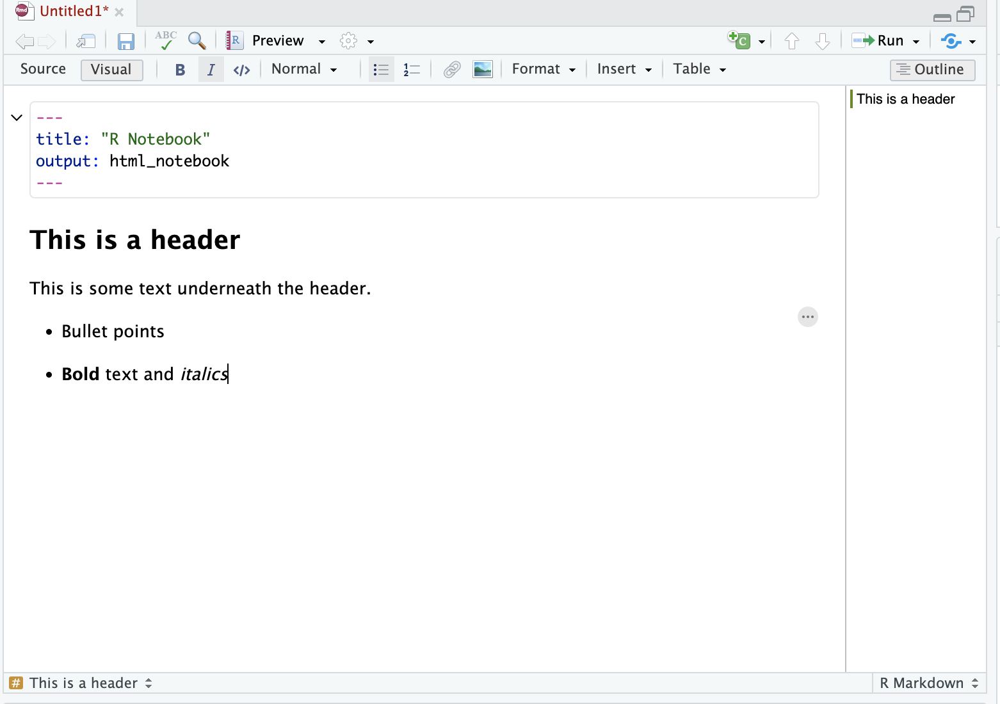

::: callout-warning
Be careful when switching between the Source and Visual editors, as this is an easy way to get weird formatting errors. A common example of this is accidentally adding the markdown code for a title (e.g `##`) in the Visual mode instead of the Source mode.
:::

### Save the file

In order to render/knit the file, it needs to be saved first.

Click file, save, and give it a name.

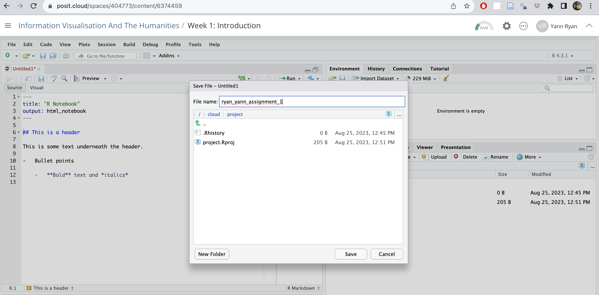

#### Naming conventions.

In this course, you will be required to use good naming conventions. Save the file with an appropriate name which communicates the most important information about the file: who created it, and what it contains.

Once you have done this, you'll see a new .Rmd file appear in the file browser, in the bottom-right pane:

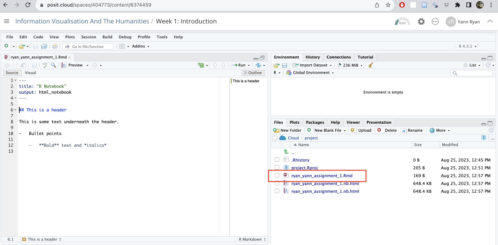

### Knit the document

Now, we'll render the document. When a document is rendered, it restarts the R engine, runs through the code, and outputs the document. In this case, it will be very quick, as we haven't written any code.

Click the drop-down where it currently says 'Preview', and then 'render HTML'. This will create a new file in your folder.

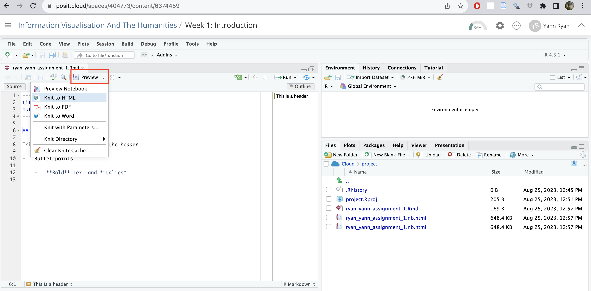

The knitted html file will preview in a new window. You can close this.

More importantly, there are now a total of three additional files in the file browser:

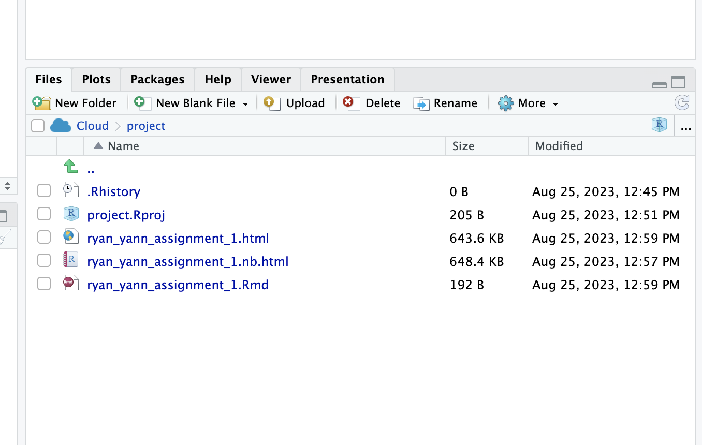{width="600"}

-   The file ending in .html is the knitted output of the markdown.

-   The file ending in .Rmd is the 'source code' of the final file.

-   The file ending in nb.html is created for making a quick preview, and can be ignored.

### Download and save the file

To submit R Markdown files as assignments in Brightspace, you'll need to download both the html output and the 'raw' markdown file to your local machine, and turn them both into a .zip file first.

Click on the checkbox for both the html and the .Rmd file.

Click on the 'More' dropdown menu, and then 'Export'

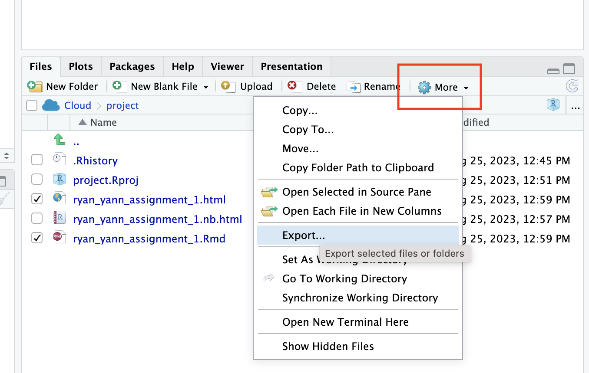{width="600"}

If you have correctly selected more than one file, Posit cloud will automatically create a .zip file and download it. Save it with a sensible name, and then you can upload this zip directly to Brightspace.

**This is the format we will use for every assignment, so it's worth getting the hang of it!**

### Upload to Brightspace

Upload the .zip file to Brightspace in the assignment area.

## Adding Code

To add a code block, use the menu items.

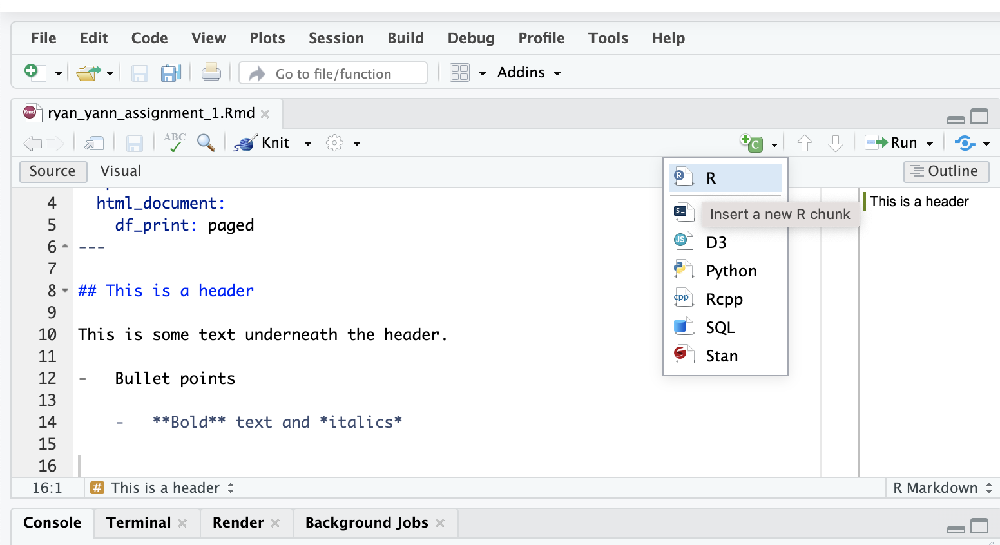{width="600"}

This will add a shaded area to your markdown file, called a 'code cell'.

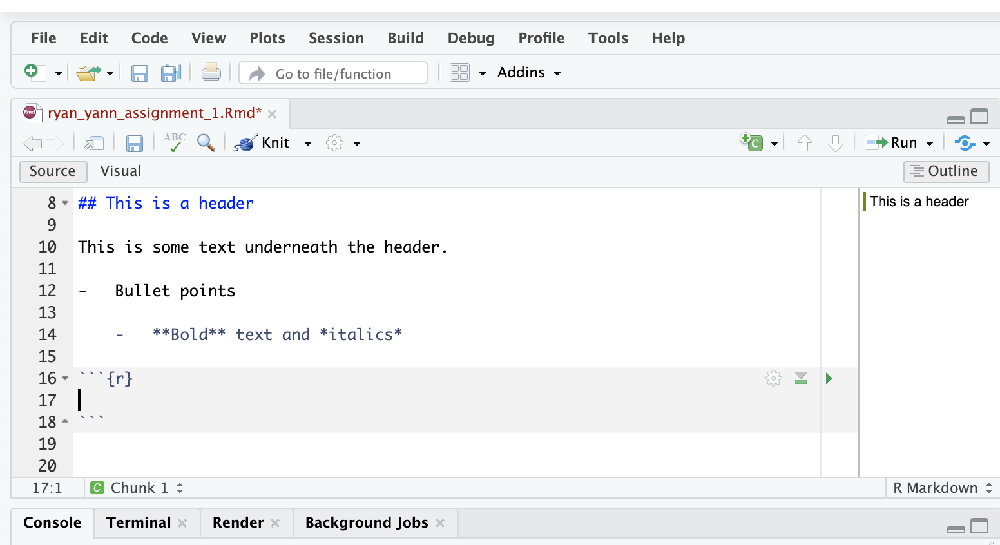{width="600"}

Add the simple code, 1 + 1. This will simply tell R to add these two numbers together.

First, execute the code from the cell, without knitting the document. Click on the green triangle in the top-right of the code cell. You'll see that the output (2) appears below the cell.

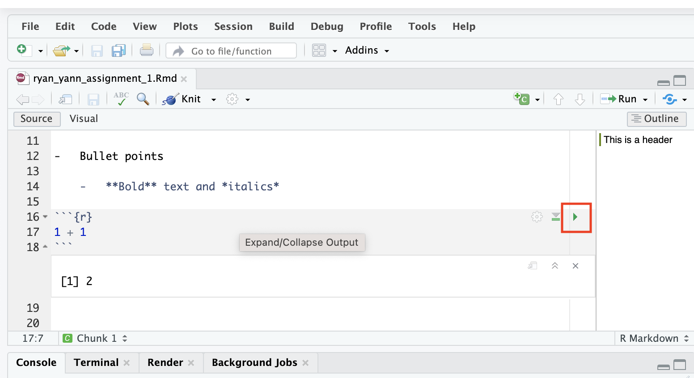{width="600"}

This is the code output. This output can be anything that we make in code, such as a visualisation. This is what makes R markdown such a great tool creating data visualisation reports. We can easily write up text and findings, and publish them alongside code results, tables, visualisations, even interactive maps.

Next, render/knit the document as in the last step. The document will knit again. Look at the html file, and you'll see that the code is displayed, and the code result - the output - is displayed underneath.

## Adding files

The last thing we'll do is practise adding files to the Rstudio area. Most times, you'll need to upload files to your workspace in order to work with them. First, you'll upload them to the workspace, and second, you'll read them into R.

You could also upload other files, for example if your final project markdown includes some images not generated by code.

We'll practise this by downloading a file from Brightspace, and uploading it to Posit Cloud. This file can be found under the 'Files' area on the course site. Download the file 'box_office' to your local machine first.

To upload a file to Posit cloud, look at the file manager in the bottom-right pane. Click on 'Upload', and then browse to the file on your computer, and click OK. You'll see the file appear in the file browser in a moment.

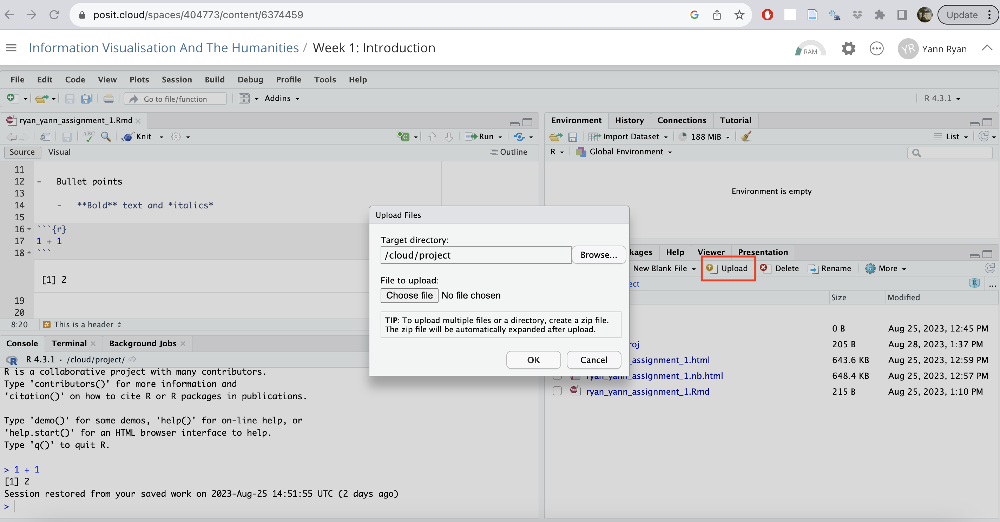

## Environment

Every time we create an object like this, it will appear within RStudio's environment. This means it has been saved in memory as an object which can be used for other purposes. When we close RStudio, the environment disappears.

You can see the objects in the environment in the top-right corner (the screenshot below will only show in the book version):

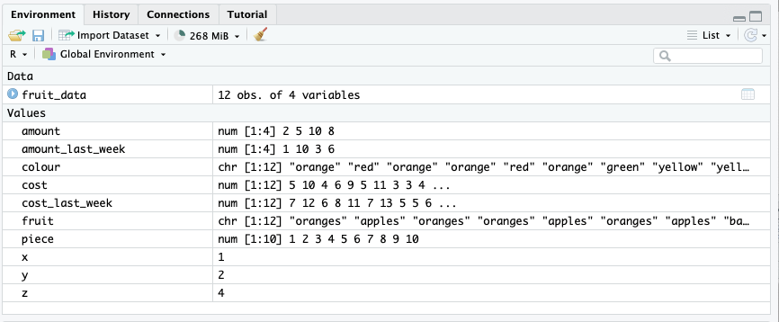

Here you'll see everything we've created, and a preview of what it contains. It's divided into `Data` and `Values`. Values are the simple things we have created. We can see that x, for example, is a single number: 4. `amount` is a vector of numbers.

Data contains any dataframes we have created. We can see we have created one, called `fruit_data`. We can also click on the `fruit_data` object to open it:

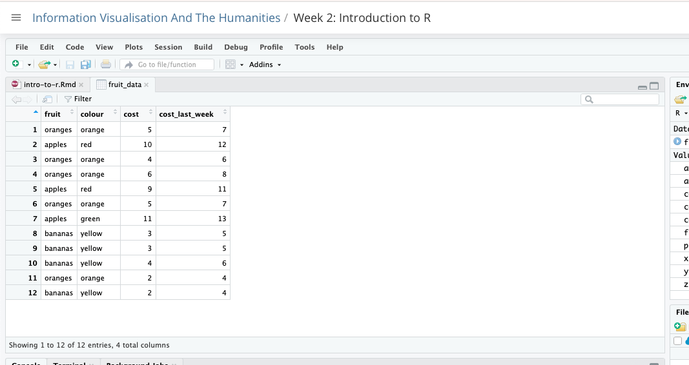

Clicking on it will open a view of the dataframe in the top-left pane. You'll see it looks much like a spreadsheet with rows and columns. This can be very useful to see how your data looks and how it has been imported.

You can close this tab or switch back to the .Rmd file to continue.

## Reading in external data

Most of the time, you'll be working with external data sources. These most commonly come in the form of comma separated values (.csv) or tab separated values (.tsv). The tidyverse commands to read these are `read_csv()` and `read_tsv`. You can also use `read_delim()`, and specify the type of delimited using `delim = ','` or `delim = '/t`. The path to the file is given as a string to the argument `file=`.

```{r, eval = FALSE}

df = read_csv(file = 'top_movie.csv') # Read a .csv file, specifying the path to the file here.

df

```

Notice that each column has a data type beside it, either <chr> for text or <dbl> for numbers. This is important if you want to sort or run calculations on the data.

## Learning Objectives

Before moving on, take a look and see if you are confident with all of the following learning objectives.

(the checkboxes are just for your own use, they won't save if you leave or refresh the page)

-   [ ] Open a Posit account and create a new notebook

-   [ ] Understand what an IDE is and how to code in it

-   [ ] Know how to create a code cell and how to write plain text in your notebook

-   [ ] Write some basic markdown

-   [ ] Export (knit) a file and download it to your local machine.

## 
