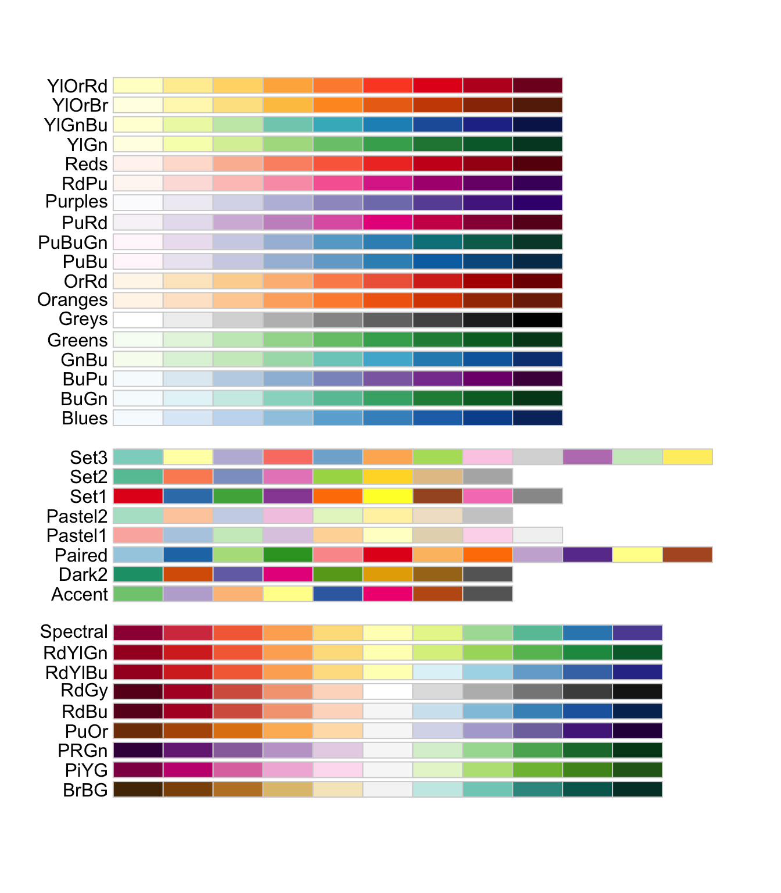

```{webr-r}
#| context: setup
library(readr)
library(ggplot2)
library(dplyr)
library(tidyr)
library(stringr)

url1 <- "https://raw.githubusercontent.com/yann-ryan/infovis_data/main/nobel/laureates_df.csv"
download.file(url1, "laureates_df.csv")
laureates_df <- read_csv('laureates_df.csv')

url2 <- "https://raw.githubusercontent.com/yann-ryan/infovis_data/main/nobel/prize_df.csv"
download.file(url2, "prize_df.csv")
prize_df <- read_csv('prize_df.csv')

nobel_df <- laureates_df |>
  left_join(prize_df, by = 'prize_id') |>
  mutate(birth_year = as.numeric(str_sub(birth_date, 1, 4)),
         age_at_award = award_year - birth_year)

```

The other key scale we will work with are colour scales. As with position, ggplot2 will pick default scales, which we can change if needed. The size scale is also often used, though it is generally less likely you'll need to make large changes to the scale.

## Colour scales with continuous and discrete data

Remember the data types from last week? How colour is mapped to data, and which scales we can and should choose, is highly dependent on the data type given. Remember too that colour is found either in the `colour` aesthetic (for example for geom_point) but also in the `fill` aesthetic (such as the fill colour of a bar chart). Both work in the same way, but use a slightly different scale name.

Mapping **categorical** data will result in a **discrete** scale, by default `scale_colour_discrete` or `scale_fill_discrete`. With this scale, ggplot will choose colours with the aim of making them as distinct from each other as possible.

Mapping **numerical** data will result in a **continuous** scale, by default `scale_colour_continuous` or `scale_fill_continuous`. With this scale, ggplot will choose a colour range where one end of the hue or saturation will be mapped to high values and the other end to low values.

Let's see how this works by mapping the fill in a bar chart to numerical and categorical data variables. To demonstrate we'll take the Nobel Prize dataset from last week and summarise it by category, as before:

```{webr-r}
nobel_summary <- nobel_df |>
  group_by(category) |>
  summarise(n = n(),
            pct_female = mean(gender == 'female', na.rm = TRUE) * 100,
            avg_age = mean(age_at_award, na.rm = TRUE))

```

The `pct_female` variable is numerical, so if we set it to the `fill` aesthetic, ggplot2 will pick a **continuous** scale. The default scale maps high values as light blue and low values as dark blue.

```{webr-r}
nobel_summary |>
  ggplot(aes(x = category, y = n, fill = pct_female)) +
  geom_col()

```

The `category` variable is itself categorical, so if we also map it to the `fill` aesthetic, ggplot2 will pick a **discrete** scale. By default, ggplot spaces the colours as evenly as possible around the [colour wheel](https://en.wikipedia.org/wiki/Color_wheel), so that each category gets as distinct a colour as possible - though as the number of categories grows, the colours inevitably become harder to tell apart, so it's worth choosing a more deliberate palette (see below) once you have more than a handful of categories.

::: callout-note
Mapping `fill` to the same variable already on the x axis looks a little redundant here - each bar is already uniquely identified by its position. It's still a very common thing to do though: it makes categories easier to scan at a glance, and becomes genuinely useful once you rearrange, facet, or remove the x axis labels later on.
:::

```{webr-r}
nobel_summary |>
  ggplot(aes(x = category, y = n, fill = category)) +
  geom_col()
```

Note that in order to communicate how values have been mapped to colours, ggplot automatically includes a **legend,** which looks different depending on the type of scale used.

There are lots of ways to choose different colour scales. In all these cases, the word colour is interchangeable with the word fill within the names of the scales.

This is done slightly differently depending on whether it's a continuous or discrete scale:

### Continuous scales

#### Use 'built in' scales

One way to alter the continuous colour scale is to specify a 'built in' one, either from ggplot2 or from another package. One example is `scale_fill_viridis_c`, which is apparently good for perception and takes into account colour vision deficiencies:

```{webr-r}
nobel_summary |>
  ggplot(aes(x = category, y = n, fill = pct_female)) +
  geom_col() +
  scale_fill_viridis_c()
```

#### Create a scale from a palette

Use `scale_fill_distiller` to specify that ggplot should take a particular palette and distribute the values evenly along it. This is the full list of palettes and their codes.

{width="500"}

To use, simply pass one of the codes to the `palette =` argument of `scale_fill_distiller`:

```{webr-r}
nobel_summary |>
  ggplot(aes(x = category, y = n, fill = pct_female)) +
  geom_col() +
  scale_fill_distiller(palette = "RdPu")
```

*Try it yourself:* Change the palette of this chart to 'Greens':

```{webr-r}

```

#### Create your own continuous scale

You can also 'make your own' palette. For instance, `scale_fill_gradient` will create a gradient colour scale in between two colours you specify. A large list of R colour names can be found here: https://r-charts.com/colors/

```{webr-r}
nobel_summary |>
  ggplot(aes(x = category, y = n, fill = pct_female)) +
  geom_col() +
  scale_fill_gradient(low = 'firebrick', high ='gold')
```

An alternative is to use `scale_fill_gradient2()`, which allows you to specify 3 colours, a low, mid and high. The function will create a scale similar to above but with a specified midpoint:

```{webr-r}

nobel_summary |>
  ggplot(aes(x = category, y = n, fill = pct_female)) +
  geom_col() +
  scale_fill_gradient2(low = 'firebrick', mid = 'white', high ='gold', midpoint = 10)

```

### Discrete scales

Discrete scales can also use 'built in' scales. The version of scale_fill_viridis for discrete scales is called `scale_fill_viridis_d`:

```{webr-r}
nobel_summary |>
  ggplot(aes(x = category, y = n, fill = category)) +
  geom_col() +
  scale_fill_viridis_d()
```

#### Create from a palette

The equivalent method for picking a scale from an existing palette is to use `scale_fill_brewer`. Again, choose a palette from the list supplied above:

```{webr-r}
nobel_summary |>
  ggplot(aes(x = category, y = n, fill = category)) +
  geom_col() +
  scale_fill_brewer(palette = 'Set2')
```

#### Fully manual scales

Finally, with discrete scales you can simply pick your own set of colours, using `scale_fill_manual`:

```{webr-r}
nobel_summary |>
  ggplot(aes(x = category, y = n, fill = category)) +
  geom_col() +
  scale_fill_manual(values = c('firebrick', 'forestgreen', 'orange', 'steelblue', 'goldenrod', 'orchid'))
```

## Size scales

The final scale which is useful to know is size. The most frequent use of the size aesthetic is to set the size of points in a scatterplot to a continuous variable.

The size scale is controlled by default by `scale_size`. This maps values to the area of a point, linearly.

```{webr-r}
nobel_summary |>
  ggplot(aes(x = avg_age, y = pct_female, size = n)) +
  geom_point()
```

One small tip is to replace `scale_size` with `scale_size_area()`, which ensures that values of 0 are mapped to zero. You can also set the `max_size =` argument within this scale to get a range of sizes you are happy with.

```{webr-r}
nobel_summary |>
  ggplot(aes(x = category, y = n, size = pct_female)) +
  geom_point() +
  scale_size_area(max_size = 10)
```

## Adjusting the legend

As with position scales, we can set limits and breaks. In this case, we'll see the change in the legend primarily.

To set the limit, specify within the scale_x\_ or scale_y function you are using. In this, any values outside the limits will be coloured by a default NA value, in this case grey.

```{webr-r}
nobel_summary |>
  ggplot(aes(x = category, y = n, fill = pct_female)) +
  geom_col() +
  scale_fill_continuous(limits = c(0,20))
```

Set the breaks using the below:

```{webr-r}
nobel_summary |>
  ggplot(aes(x = category, y = n, fill = pct_female)) +
  geom_col() +
  scale_fill_continuous(breaks = seq(0, 20, by = 5))
```

You can make changes to the legend in other ways, using the `guides()` function. Here are some examples:

```{webr-r}
nobel_summary |>
  ggplot(aes(x = category, y = n, fill = pct_female)) +
  geom_col()  +
  guides(fill = guide_colorbar(reverse = TRUE))


```

Use `barheight` to set the height of the legend (you can use barwidth to set the width):

```{webr-r}
nobel_summary |>
  ggplot(aes(x = category, y = n, fill = pct_female)) +
  geom_col() +
  guides(fill = guide_colourbar(barheight = unit(8, "cm")))


```

Change from vertical to horizontal:

```{webr-r}
nobel_summary |>
  ggplot(aes(x = category, y = n, fill = pct_female)) +
  geom_col() +
  guides(fill = guide_colourbar(direction = "horizontal"))
```

::: callout-note
Changing the position and other visual aspects of the legend is done within *themes*, which we'll cover later this week.
:::
