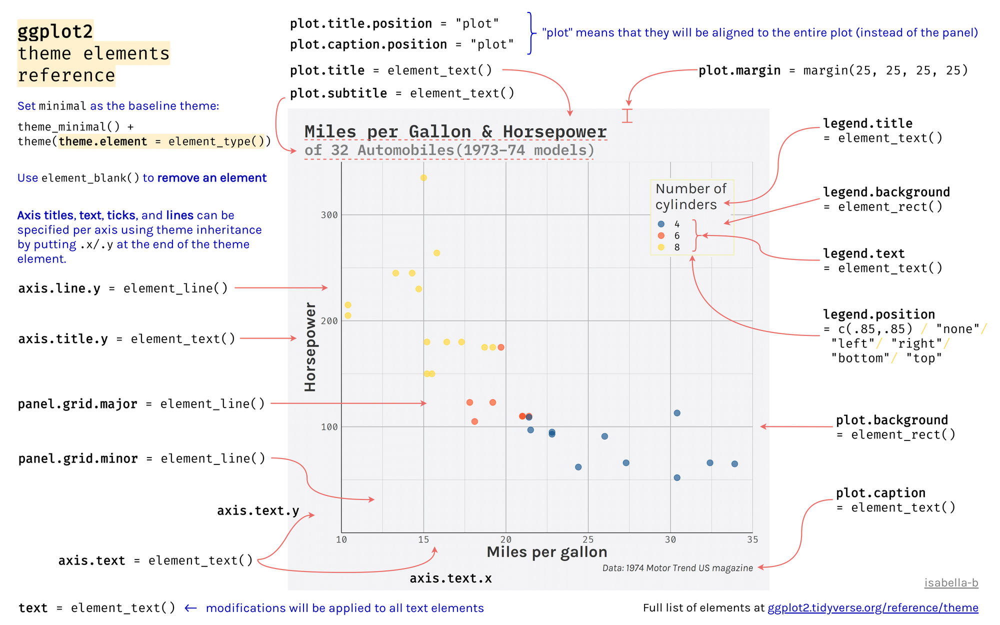

```{webr-r}
#| context: setup
library(readr)
library(ggplot2)
library(dplyr)
library(tidyr)
library(stringr)

url1 <- "https://raw.githubusercontent.com/yann-ryan/infovis_data/main/nobel/laureates_df.csv"
download.file(url1, "laureates_df.csv")
laureates_df <- read_csv('laureates_df.csv')

url2 <- "https://raw.githubusercontent.com/yann-ryan/infovis_data/main/nobel/prize_df.csv"
download.file(url2, "prize_df.csv")
prize_df <- read_csv('prize_df.csv')

nobel_df <- laureates_df |>
  left_join(prize_df, by = 'prize_id') |>
  mutate(birth_year = as.numeric(str_sub(birth_date, 1, 4)),
         age_at_award = award_year - birth_year)

df <- nobel_df |>
  group_by(category) |>
  summarise(n = n(),
            pct_female = mean(gender == 'female', na.rm = TRUE) * 100,
            avg_age = mean(age_at_award, na.rm = TRUE))

```

Recall that the 'grammar' of a ggplot chart is made up of a number of different layers:

{width="500"}

The look of the non-data elements of your chart can be highly customised, using the **theme** layer, described in this diagram as 'all the non-data ink'. The non-data elements are things like the colour and size of the ticks and lines, the font and colour of the titles, and the look of the chart background. Below is a typical chart, with all of the elements we can make changes to.

{width="500"}

There are two ways to use themes: first, you can add preset themes to your chart, or you can specify individual elements directly using the theme() layer.

## Preset themes

ggplot2 has some preset themes, which, when added to your charts, will change multiple elements of your chart at once. To use one of these, simply add the theme name as a layer to your chart using `+`. Note that you can override individual elements of a theme by using a theme() layer after the preset.

The full list of themes are [here](https://ggplot2.tidyverse.org/reference/ggtheme.html). This will add theme_light() to the plot:

```{webr-r}

df |>
  ggplot(aes(x = avg_age, y = pct_female, size = n, color = category))  +
  geom_point()+
  theme_light()

```

**Try it yourself:** edit the code above and try out some of the other themes found in the link.

### Add-ons

Another way to change the complete look and feel of your chart is to download packages containing additional themes, such as [ggthemes](https://github.com/jrnold/ggthemes) and [ggtech](https://github.com/ricardo-bion/ggtech). You can also [make your own resusable themes from scratch](https://rpubs.com/mclaire19/ggplot2-custom-themes).

## Extra-chart elements using theme()

Using the default settings will make an accurate representation of your data but there are lots of ways to make a chart more readable. We can control many visual elements of the chart to a high degree.

Each visual part of a chart is known as an **element**, and we can make changes to each part separately. This is done by adding `+ theme()` layer to your chart, followed by the element you want to change, then an element type, and finally, the aesthetics of that element you want to change. The full list of elements and types can be found in the figure below - it's very useful to save a copy as a reference.

It seems like a lot, so let's see how this works with an example. Let's change the **size** of the **x axis title** in the chart we made above (this is the axis label itself, e.g. "avg_age" - not to be confused with `axis.text`, which controls the tick labels/numbers along the axis).

To do this, I first add a new layer with `+ theme()` to my existing plot.

Next, within this `theme()`, I add:

-   The plot element I would like to change, which in this case is `axis.title.x` followed by an `=` sign. We can also change both axes at once using `axis.title`, or just the y axis using `axis.title.y`.

-   The type of element it is (we'll come back to this), either `element_text()`, `element_rect()`, `element_line()` or, if I want to remove it entirely, `element_blank()`.

In this case, it is a text element, so we use `element_text()`.

Next, within this `element_text()`, we specify the changes we want to make, using the usual set of aesthetics. For a text element, we can change the `size`, the font (using `family`) and whether it is bold or italic (using `face`).

To change the size of the text to 16, use the following full line of code:

```{webr-r}

df |>
  ggplot(aes(x = avg_age, y = pct_female, size = n, color = category))  +
  geom_point() +
  theme(axis.title.x = element_text(size = 16))

```

Different types of elements need to be specified in different ways, and have different aspects which can be adjusted. Below is a full list of the plot parts and their related element types:


## Exercises:

Copy and paste the chart above into a new cell. Make the following changes:

-   Change the panel background fill to `lightblue`.

-   Change the size of the title to 24, and the 'face' to bold.

-   Change the panel grid to the `linetype` 'dashed'.

```{webr-r}

```

### Some useful things to change:

Changing the angle of text in a bar chart. We change the angle, but because it rotates around the middle and we would like the end of the text to line up with the appropriate bar, we also need to use hjust and vjust. This is particularly useful here, since some of the category names ("Physiology or Medicine", "Economic Sciences") are too long to sit comfortably horizontally:

```{webr-r}

df |>
  ggplot(aes(x = category, y = n)) +
  geom_col() +
  theme(axis.text.x = element_text(angle = 45, hjust = 1, vjust = 1))

```

The text format of the title and subtitle:

```{webr-r}

df |>
  ggplot(aes(x = category, y = n)) +
  geom_col() +
  theme(axis.text.x = element_text(angle = 45, hjust = 1, vjust = 1)) +
  labs(title = "Nobel Prizes by Category", subtitle = "1901 - 2024") +
  theme(plot.title = element_text(family = "Times New Roman", size = 22),
        plot.subtitle = element_text(family = "Times New Roman", face = "bold"))

```

You can also change all the text at once:

```{webr-r}
df |>
  ggplot(aes(x = category, y = n)) +
  geom_col() +
  theme(axis.text.x = element_text(angle = 45, hjust = 1, vjust = 1)) +
  labs(title = "Nobel Prizes by Category", subtitle = "1901 - 2024") +
  theme(text = element_text(family = 'Times New Roman'))
```
